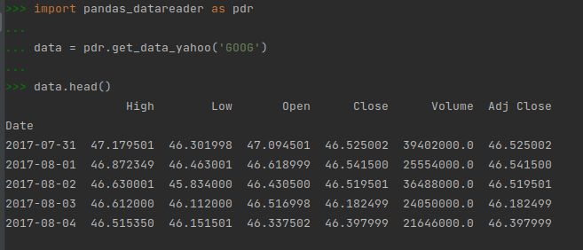
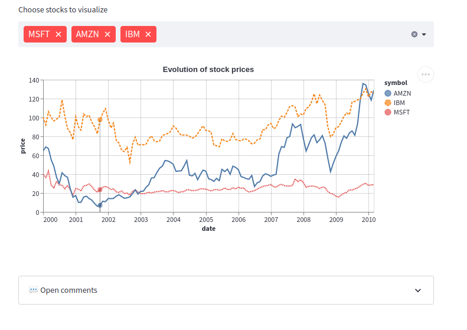
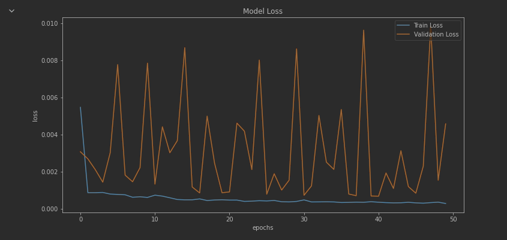
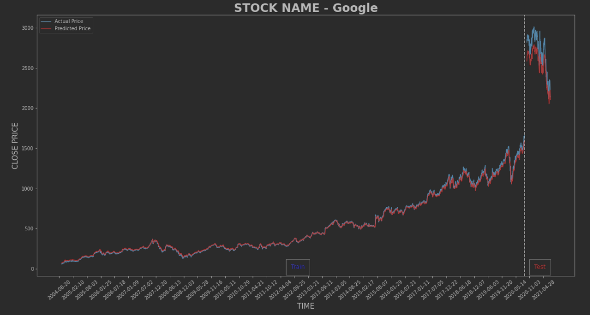

# Final Project
The goal of this project is to train a time series model to accurately predict stock prices for any generic stock.

* **Selected topic**: Time series stock prediction
* **Reason why I selected this topic**: I am personally interested in stock prediction, as I spend my free time investing in stocks.
* **Description of source of data**: I am using publicly available stock ticker data, sourced from yahoo via the `pandas_datareader` library.
* **Questions I hope to answer with the data**:
  * Can stock price data be predicted using stock price history data and machine learning models?
  * Are certain stocks easier to predict than others?

## Communication protocols
The data used in this project is stock ticker data (time series). The raw data comes in the following format:

Data for any stock ticker can be pulled using this one-liner function, and then stored in a SQL (or mongo) database accordingly.
We will be focusing our analysis on using only the Date and Close columns.

## Technology
The following technologies were used in this project:
* EDA: `pandas` / `numpy`
* DB: `mongo`
* Machine Learning: `sklearn` / `tensorflow` / `keras`
  * LSTM neural networks are the choice of model here
* Dashboard: `streamlit`

### Data cleaning and analysis
* `pandas_datareader` will be used to retrieve the data
* `pandas` / `numpy` will be used to perform exploratory analysis and format it into a structure conducive for time series machine learning algorithms.

### Database storage
* This database can easily be kept in memory and retrieved as needed.
* Alternatively, if the data proves too large to fit into memory, we can store the data in a sqlite or psql database. Another alternative is mongo, since we do not need the relational aspect of sql and it will be simpler.
* See [main](main.ipynb) for an example of a sample database in action with this data.
* See [main](db.ipynb) for the setup of our fully integrated database. It shows:
  * Static data stored for project
  * How we can interface with the project (CRUD)
  * Two collections in MongoDB
  * Connection string
  * No joins (because not necessary for this project, and we are using MongoDB)

### Machine Learning
* `sklearn` / `pytorch` / `keras` will be used to build the machine learning time series models. We may also use `statsmodels` to fit an STL model.
* See [main](main.ipynb) for an example of a sample (dummy) machine learning model in action with this data.
* See [EDA notebook](EDA.ipynb) for details on how data was preprocessed, including feature generation and train-test split.
* See the end of [EDA notebook](EDA.ipynb) for details on why I chose to use LSTM neural network model.

### Dashboard
We're planning on building our dashboard using python's [streamlit](https://streamlit.io/). This is a new, very exciting library that allows one to "automate the boring stuff" and quickly build interactive data apps. It was specifically designed with machine learning applications in mind.

My plan for this dashboard is to allow the user to choose a company from a preset list of companies, train an LSTM, and then choose between a few plots to analyze the results.
These plots will include:
1. Training vs. validation loss by epoch 
2. Historical stock prices overlayed with predictions 

This tool can also be used to generate predictions.

## Data Exploration
* The time series data did not come in a format that is conducive for machine learning.
* I decided to only use the "Closed" column of the data, and normalized / reshaped it so a machine learning model could be used.
* See the [EDA notebook](EDA.ipynb) for details about the exploration

## Analysis
* I did a preliminary analysis of the data, as well as research on commonly used models, and came up with a plan for the machine learning phase of the project.
* I plan to use an LSTM neural network and tune some of the many hyperparameters.
* This model should work great on the preprocessed data I produced in the Data Exploration phase of the project.
* The details can be found at the end of the [EDA notebook](EDA.ipynb).
