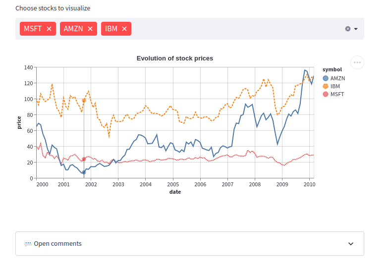
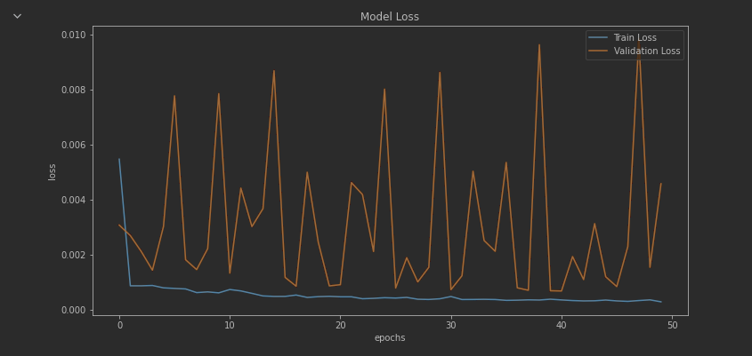
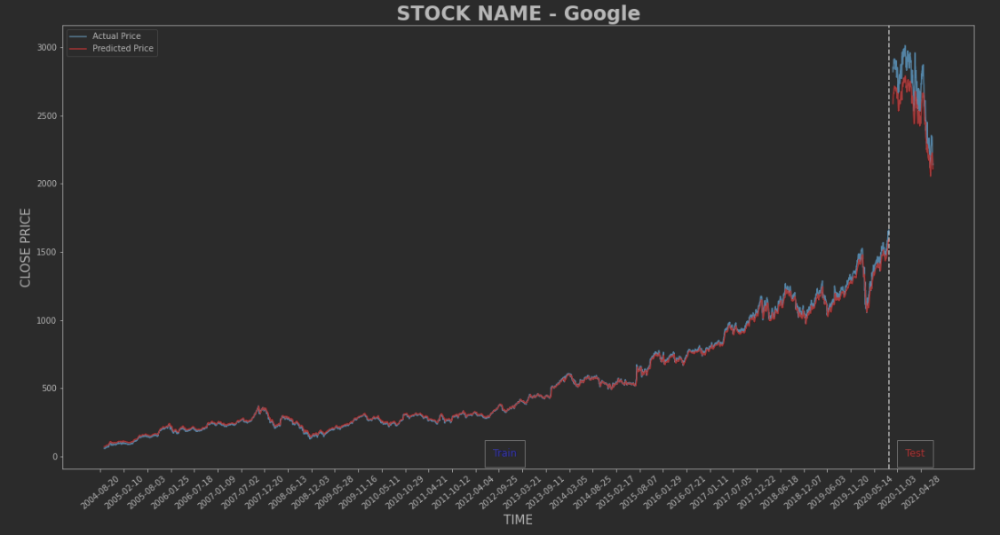

# Dashboard
We're planning on building our dashboard using python's [streamlit](https://streamlit.io/). This is a new, very exciting library that allows one to "automate the boring stuff" and quickly build interactive data apps. It was specifically designed with machine learning applications in mind.

My plan for this dashboard is to allow the user to choose a company from a preset list of companies, train an LSTM, and then choose between a few plots to analyze the results.
These plots will include:
1. Training vs. validation loss by epoch 
2. Historical stock prices overlayed with predictions 

This tool can also be used to generate predictions.
